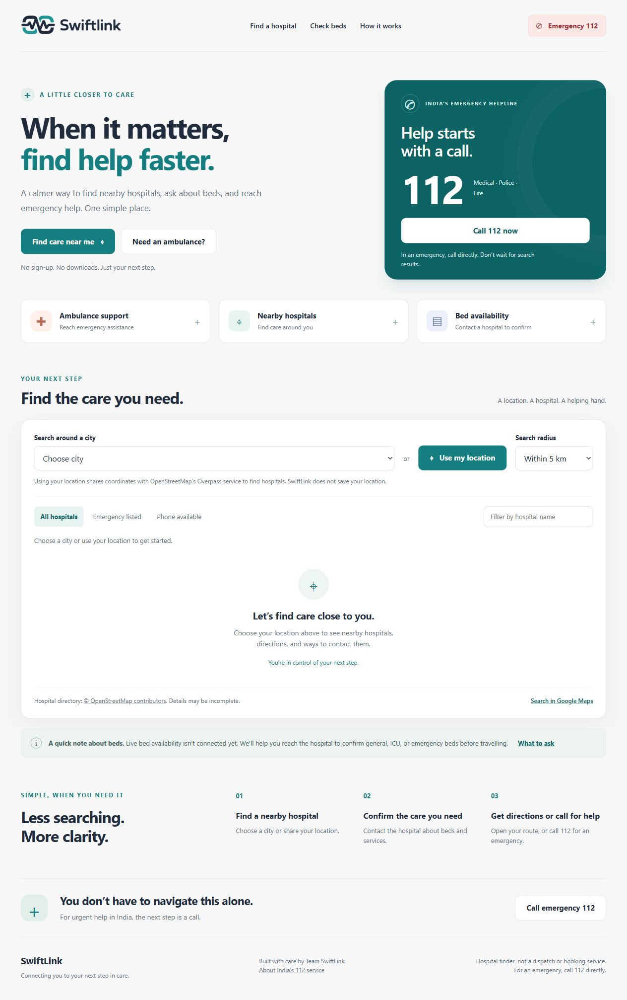
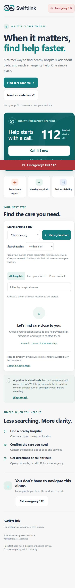

# SwiftLink

**A little closer to care.** A fast, comforting emergency-aid website built for patients and the people helping them.

**[Open the live website](https://geriayug30-png.github.io/SwiftLink/)**

## Project Overview

SwiftLink brings three urgent tasks into one simple screen: reaching India's emergency helpline **112**, finding nearby hospitals, and contacting hospitals to check whether the required bed and services are available. The supplied SwiftLink logo is preserved unchanged, with a calming teal-and-navy design.

**This is a hospital-directory and contact tool. It does not dispatch ambulances, book beds, or provide live bed counts. In an emergency, call 112 directly.**

## Setup & Installation Instructions

There is **nothing to install**: no framework, package manager, API key, database, or build process.

1. Download this repository using **Code → Download ZIP**, then extract it (or clone it).
2. Open **index.html** in a modern browser.
3. Select a city to find hospitals. For the most reliable location permissions and API access, use the hosted HTTPS site or a local server.

Optional local server, if Python is already installed:

```bash
git clone https://github.com/geriayug30-png/SwiftLink.git
cd SwiftLink
python -m http.server 8000
```

Open `http://localhost:8000`. You can also use your editor's Live Server extension.

### GitHub Pages

In the repository's **Settings → Pages**, choose **Deploy from a branch**, select **main** and **/ (root)**, then save. No build configuration is required.

## Key Features

- Prominent one-tap **112** call links and a persistent emergency bar on mobile.
- Ambulance assistance panel with concise information to share with the emergency operator.
- Nearby hospital search using device location or ten Indian city presets.
- Search radii of 5, 10, and 20 km, with nearest-first results and straight-line distances.
- Filters for hospital name, listed emergency service, and available phone numbers.
- Hospital contact links, Google Maps directions, and a bed-enquiry checklist.
- Honest **availability not verified** labels instead of invented bed counts.
- Accessible labels, keyboard navigation, dialog focus handling, reduced-motion support, and responsive layouts.
- Loading, empty, permission-denied, timeout, and network-error states with a Maps fallback.
- Five-minute in-memory hospital-query caching. No patient data collection or location storage.

## Technology Stack

| Layer | Technology |
| --- | --- |
| Structure | Semantic HTML5 |
| Design | CSS3, Grid, Flexbox, responsive media queries |
| Interactions | Plain JavaScript, Fetch, native dialog |
| Location | Browser Geolocation API |
| Hospital directory | OpenStreetMap via Overpass API |
| Directions | Google Maps URL links |
| Hosting | Any static web host, including GitHub Pages |

## Architecture / Workflow

```text
index.html       Page structure and emergency actions
styles.css       Responsive teal-and-navy design
app.js           Location, directory search, filters, and dialogs
assets/
  swiftlink-logo.png   Original supplied logo
README.md        Project documentation
```

1. The visitor selects a city or explicitly requests device location.
2. JavaScript sends a bounded hospital query to Overpass.
3. Results are normalized, duplicate entries removed, and distances calculated locally.
4. The visitor filters results, calls a listed number, or opens directions.
5. Bed availability is confirmed directly with the hospital; SwiftLink makes no reservation.

All code runs in the browser. No server-side application or login is needed. External text is inserted with `textContent`, and telephone values are validated before creating call links. Superseded requests are cancelled so older search responses cannot replace newer results.

## Dataset / API Information

- **Hospital data:** [OpenStreetMap contributors](https://www.openstreetmap.org/copyright), provided under the Open Database License, queried through the [Overpass API](https://wiki.openstreetmap.org/wiki/Overpass_API). Endpoint: `https://overpass-api.de/api/interpreter`.
- Queries retrieve nearby objects tagged `amenity=hospital` or `healthcare=hospital`; data can include hospital names, coordinates, addresses, phone numbers, and emergency-service tags.
- Phone numbers and emergency tags are community-maintained directory entries, not independently verified service guarantees. Missing information is shown honestly.
- **No live bed-availability dataset is connected.** A hospital's total capacity is never presented as currently available beds.
- City coordinates are fixed search centres, not the visitor's location. Device coordinates are requested only after tapping **Use my location**, then sent to Overpass. They remain in memory and are not saved by SwiftLink.
- Google Maps links open an external service, which receives the search or destination. Read the providers' own privacy policies before using them.
- The public Overpass endpoint is a shared service and may be slow, rate-limited, unavailable, or blocked by a browser/network. Requests are user-triggered, bounded, cached in memory for five minutes, and time out after 25 seconds. Production-scale use should use a suitable hosted or self-managed provider.
- The [Government of India's 112 service](https://112.gov.in/) is the source for the emergency number. SwiftLink is an independent project, not an official government or hospital service.

## Screenshots / Demo Information

**Live demo: [geriayug30-png.github.io/SwiftLink](https://geriayug30-png.github.io/SwiftLink/)** — deployed with GitHub Pages. You can also open `index.html` directly.



<details>
<summary>Mobile screenshot</summary>



</details>

Checked on desktop and at a 390px mobile viewport. Live Mumbai hospital results, name and phone filters, empty-result handling, ambulance and bed-enquiry dialogs, and the unmodified logo were verified. No emergency calls were placed during testing.

Suggested walkthrough:

1. Open the ambulance panel without placing a call.
2. Select Mumbai, or use a location with permission.
3. Try hospital-name and contact filters, then change the search radius.
4. Open **Ask about beds** and review the confirmation checklist.
5. Open directions to a selected hospital.
6. Check the layout on a phone. Do **not** call emergency services for testing.

## Limitations & Future Scope

- No real-time bed inventory, ambulance booking, vehicle tracking, ETA, or patient triage.
- Hospital listings may omit facilities or contain outdated details. Call to confirm services and availability.
- Distances are straight-line estimates, not driving distances or travel times.
- The city selector searches around a city centre; device location provides a more relevant starting point.
- Internet is needed for hospital searches and maps. The page and 112 links remain usable without a successful directory response, but placing a call requires a supported device and telephone service.
- Location permission depends on browser support and secure contexts; use HTTPS or localhost for reliable behaviour.
- The initial directory displays up to 30 nearest matches to keep the page quick.
- Future work: verified hospital partnerships and authenticated, timestamped bed feeds; confirmed ambulance-dispatch integration; multilingual access; accessible map view; provider monitoring and service-level guarantees.

## Team Members

| Name | Role |
| --- | --- |
| **Shree Gawde** | **Leader** |
| Bhumika Dubey | Team Member |
| Yug Geria | Team Member |
| Jay Dama | Team Member |
